# 2. Problem Statement

Managing library records manually can become difficult when the number of books, students, and transactions increases. Manual records may require more time to update and can make it difficult to track book availability, issued books, return dates, and overdue fines.

The proposed Library Management System provides a simple computerized solution for managing these operations. It maintains book and student records, handles book issue and return operations, stores transaction history, calculates overdue fines, and generates library reports.

# 3. Objectives

The main objectives of the project are:

- To develop a simple and user-friendly library management system.
- To manage book records efficiently.
- To maintain student registration records.
- To automate book issue and return operations.
- To maintain transaction history.
- To calculate fines for overdue books.
- To provide a summary report of library activities.
- To validate user input and prevent invalid records.
- To store data persistently using JSON files.
- To demonstrate modular programming and object-oriented programming concepts in Python.

# 4. Target Users

The primary target user of the system is a librarian or library staff member who needs to manage books, students, and borrowing transactions.

The system can also serve as a learning project demonstrating how Python can be used to develop a small real-world management application.

# 5. Functional Requirements

## 5.1 Book Management

The system shall allow the librarian to:

- Add new books with book ID, title, author, category, and quantity.
- Display all stored book records.
- Search for books using Book ID or title.
- Update existing book information.
- Remove books when they are not currently issued.

## 5.2 Student Management

The system shall allow the librarian to:

- Register new students with Student ID, name, course, and email.
- Display registered students.
- Search for students using Student ID or name.
- Prevent duplicate Student IDs.

## 5.3 Transaction Management

The system shall allow the librarian to:

- Issue books to registered students.
- Check book availability before issuing.
- Prevent the same student from having the same book issued twice.
- Return issued books.
- Calculate fines for overdue books.
- Maintain transaction history.

## 5.4 Library Report

The system shall generate a report containing:

- Total book copies.
- Available book copies.
- Issued book copies.
- Total registered students.
- Active borrowings.
- Overdue books.
- Total recorded fines.

## 5.5 Data Storage

The system shall:

- Store book information in `books.json`.
- Store student information in `students.json`.
- Store transaction information in `transactions.json`.
- Load previously saved data.
- Save changes after important operations.

## 5.6 Input Validation

The system shall:

- Prevent empty required fields.
- Validate positive quantities.
- Validate email format.
- Prevent duplicate Book IDs and Student IDs.
- Display appropriate error messages for invalid input.

# 6. Non-Functional Requirements

## 6.1 Usability

- The system provides a simple menu-based terminal interface.
- Menu options are clearly displayed.
- Users can enter commands using simple words.
- Clear success and error messages are displayed.

## 6.2 Reliability

- The system checks whether books and students exist before performing transactions.
- Invalid operations are prevented.
- Data is saved after important operations.
- Previously stored data can be loaded when the program runs again.

## 6.3 Performance

- The system performs common operations such as searching and displaying records efficiently for a small library.
- JSON files provide simple and lightweight data storage.
- The modular structure keeps individual operations focused.

## 6.4 Maintainability

- The program is divided into separate modules.
- Each module has a specific responsibility.
- Common file operations are handled by `file_handler.py`.
- Input validation is handled by `validation.py`.

## 6.5 Error Handling

- Empty input is rejected where required.
- Invalid quantities are rejected.
- Invalid email addresses are detected.
- Duplicate Book IDs and Student IDs are prevented.
- Invalid menu commands display an appropriate error message.

## 6.6 Data Integrity

- Book availability is updated when books are issued or returned.
- A book cannot be issued when no copies are available.
- A book cannot be removed while its copies are issued.
- Transaction records maintain issue, return, fine, and status information.

## 6.7 Scalability

- The modular architecture allows new features to be added independently.
- The storage layer can be replaced with a database in a future version.
- Additional modules such as authentication, advanced search, or user management can be added later.

# 7. System Architecture

The Library Management System follows a modular architecture. The main program (`main.py`) controls the application menus and connects the different functional modules.

The major modules are:

- `main.py` — controls the main menu and navigation.
- `book.py` — manages book records.
- `student.py` — manages student records.
- `transaction.py` — handles book issue, return, fines, and transaction history.
- `report.py` — generates library statistics.
- `validation.py` — validates user input.
- `file_handler.py` — handles loading and saving JSON data.

The system stores data in three JSON files:

- `books.json`
- `students.json`
- `transactions.json`

The architecture diagram below represents the relationship between these components.

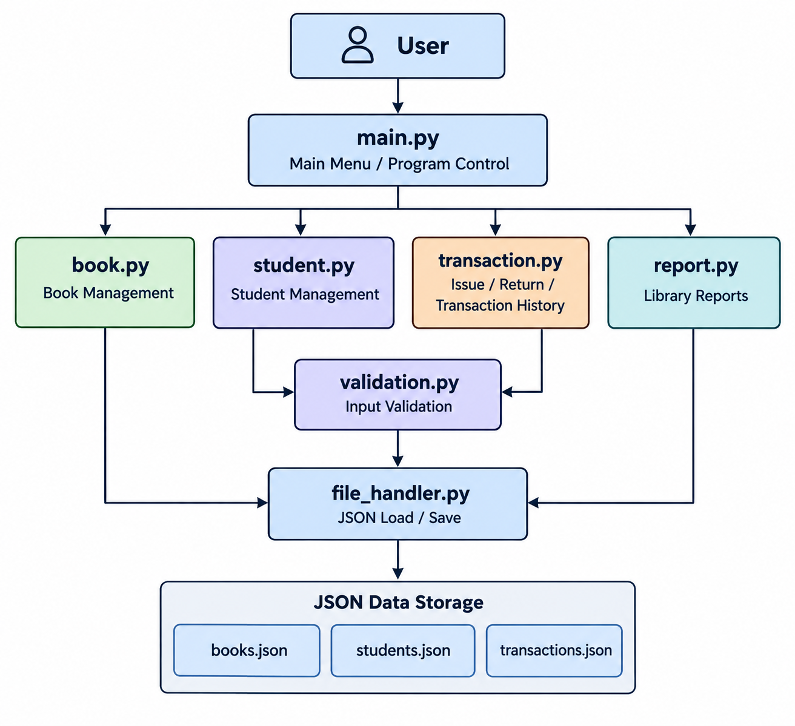

# 8. System Workflow

The system follows a simple workflow for managing library operations:

1. The user starts the Library Management System.
2. The main menu is displayed.
3. The user selects a module such as Book Management, Student Management, Transactions, or Library Report.
4. Book and student information can be added, displayed, searched, updated, or managed as required.
5. During a transaction, the system verifies the student and book details.
6. The system checks book availability before issuing a book.
7. When a book is returned, the system updates its availability and calculates any applicable fine.
8. Transaction information is stored for future reference.
9. The Library Report provides a summary of the current library status.
10. The user can exit the system.

The workflow diagram below illustrates the overall process.

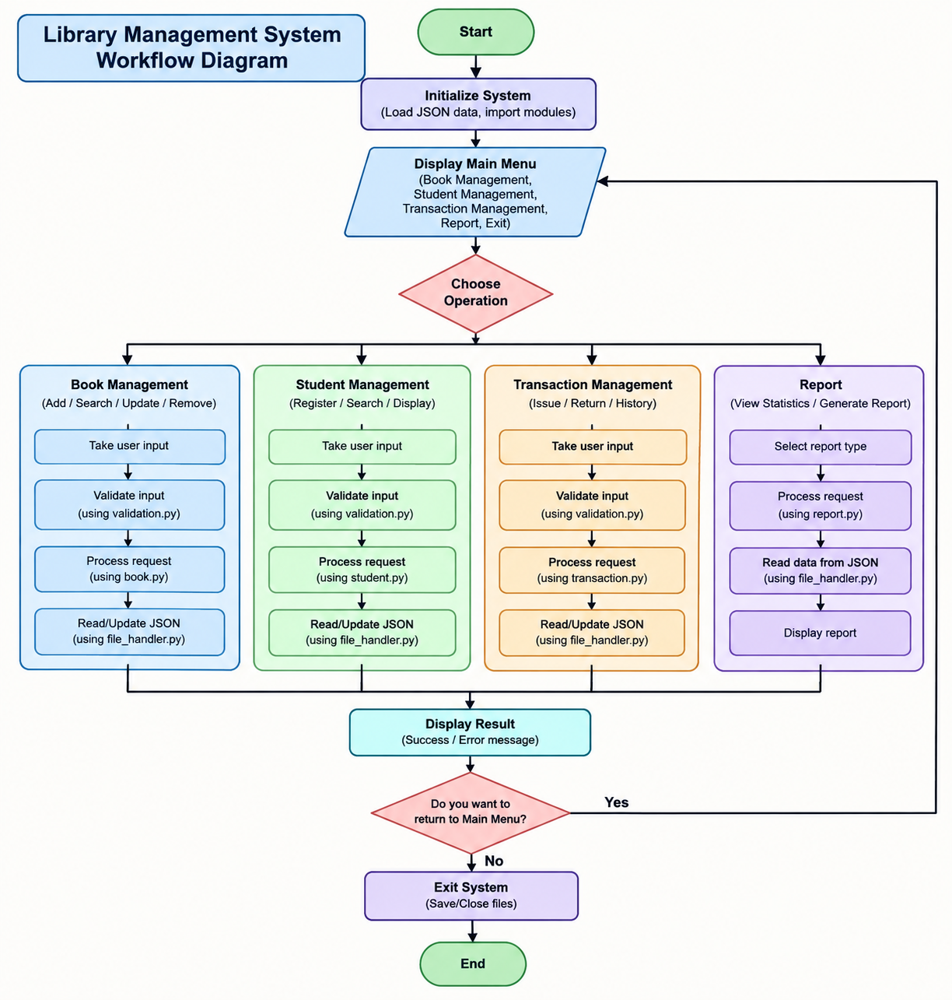

# 9. UML Use Case Diagram

The UML use case diagram shows the main interactions between the librarian and the Library Management System.

The librarian can:

- Manage books
- Manage students
- Issue books
- Return books
- View transaction history
- Generate library reports

The use case diagram is shown below.

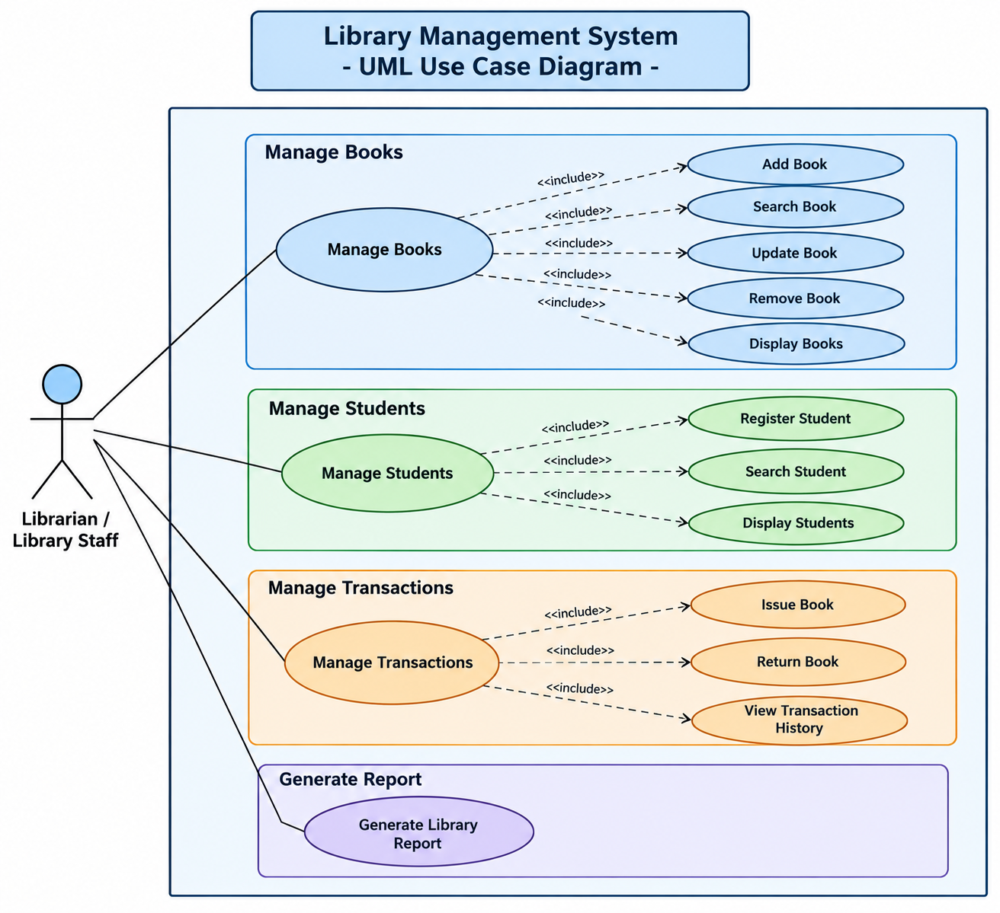

# 10. Component Diagram

The component diagram represents the major software components of the Library Management System and their relationships.

The main components include:

- `main.py`
- `book.py`
- `student.py`
- `transaction.py`
- `report.py`
- `validation.py`
- `file_handler.py`
- JSON data files

The component diagram is shown below.

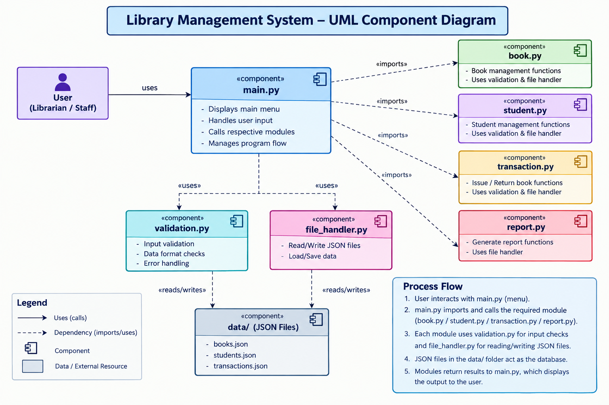
## 10.1 Class Diagram

The class diagram represents the main classes used in the Library Management System. It shows the attributes and methods of the `Book`, `Student`, `Transaction`, and `Report` classes.

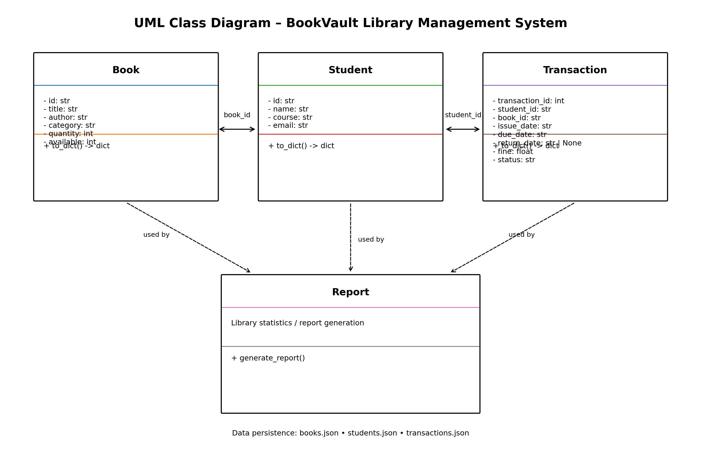

## 10.2 Sequence Diagram

The sequence diagram illustrates the interaction between the user, application modules, and data storage during a library transaction.

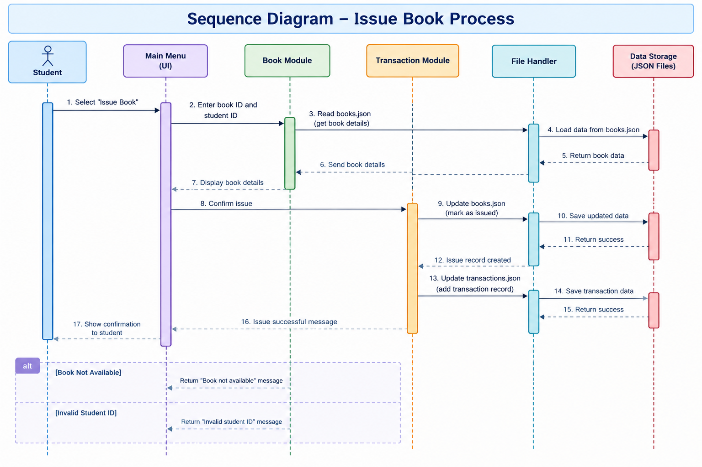

## 10.3 ER / Storage Design

The ER / Storage Design shows the main entities of the Library Management System and how their information is represented and stored using JSON files.

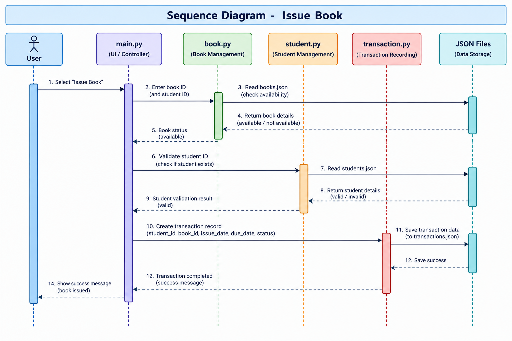

# 11. Implementation

The Library Management System was implemented using Python.

The implementation is divided into multiple modules to improve organization and maintainability.

## 11.1 Book Module

The `book.py` module manages book-related operations such as adding, displaying, searching, updating, and removing books.

The `Book` class represents a book and stores information such as Book ID, title, author, category, quantity, and availability.

## 11.2 Student Module

The `student.py` module manages student registration, display, and search operations.

The `Student` class stores Student ID, name, course, and email information.

## 11.3 Transaction Module

The `transaction.py` module handles book issue, return, transaction history, due dates, and fine calculation.

The `Transaction` class stores transaction information including Student ID, Book ID, issue date, due date, return date, fine, and transaction status.

## 11.4 Report Module

The `report.py` module generates a summary of the current library status.

It calculates total book copies, available copies, issued copies, registered students, active borrowings, overdue books, and recorded fines.

## 11.5 Validation Module

The `validation.py` module provides reusable validation functions for checking required fields, quantities, and email addresses.

## 11.6 File Handler Module

The `file_handler.py` module provides functions for loading and saving JSON data.

This keeps file-handling operations separate from the main application logic.

# 12. Data Storage Design

The system uses JSON files for persistent data storage.

Three files are used:

### Books

`books.json` stores:

- Book ID
- Title
- Author
- Category
- Quantity
- Available copies

### Students

`students.json` stores:

- Student ID
- Name
- Course
- Email

### Transactions

`transactions.json` stores:

- Transaction ID
- Student ID
- Book ID
- Issue date
- Due date
- Return date
- Fine
- Transaction status

The storage design allows the application to preserve records after the program is closed.

# 13. Testing and Results

The system was tested manually using valid and invalid inputs.

The major tested areas included:

- Book Management
- Student Management
- Book Issue
- Book Return
- Transaction History
- Library Report
- Input Validation
- JSON Data Storage
- Menu Navigation

All major functional tests were successfully completed.

The detailed testing results are documented separately in:

`docs/Documentation/testing_results.md`

# 14. Screenshots and Results

The following screenshots demonstrate the working Library Management System.

## 14.1 Main Menu

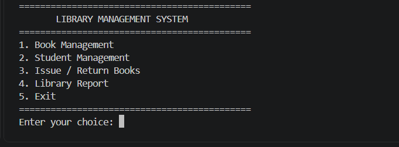

## 14.2 Book Management Menu

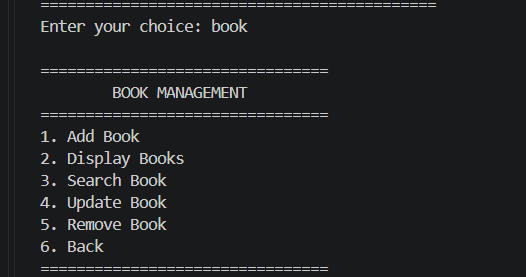

## 14.3 Book Display

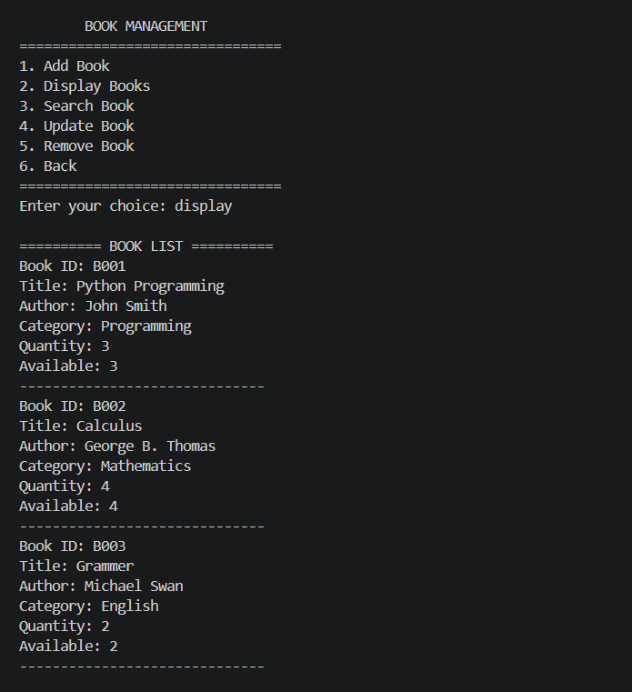

## 14.4 Student Management Menu

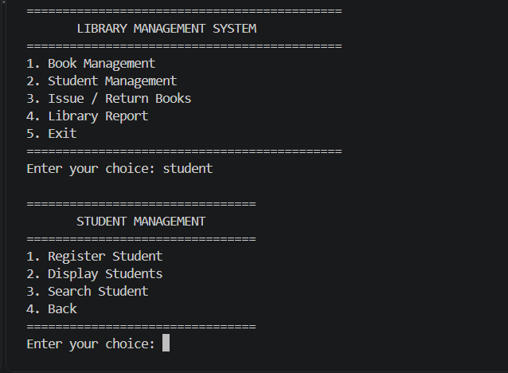

## 14.5 Student Display

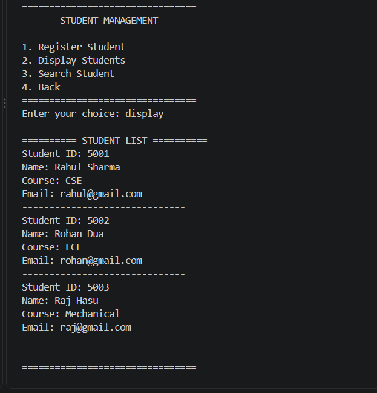

## 14.6 Transaction Menu

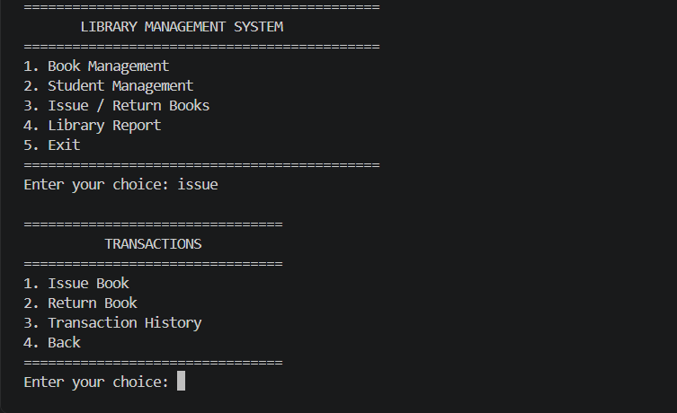

## 14.7 Transaction History

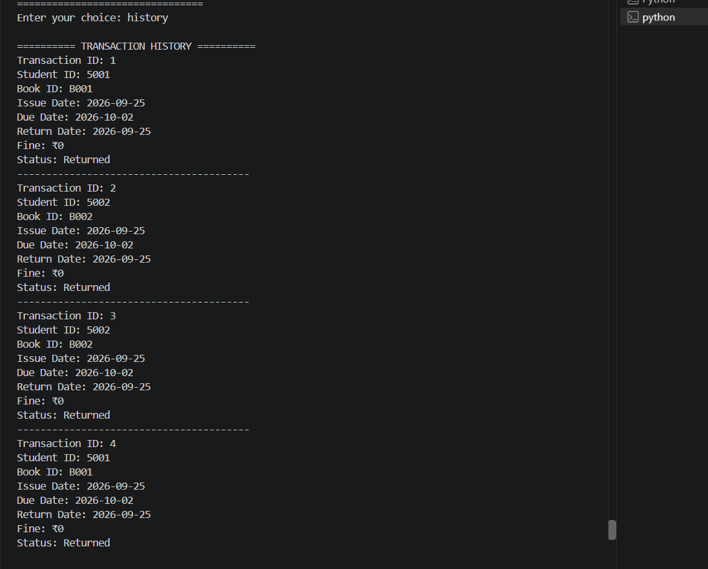

## 14.8 Library Report

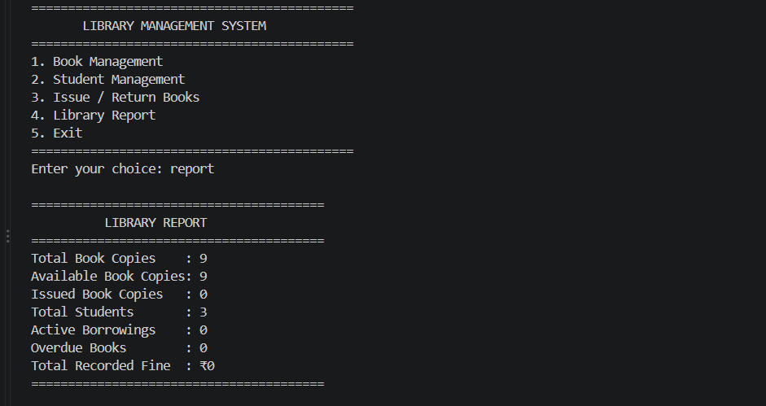

# 15. Design Decisions and Rationale

The project uses a modular Python structure to separate different responsibilities.

Object-oriented programming was used to represent entities such as books, students, and transactions.

JSON was selected as the storage method because it provides a simple way to store structured data without requiring a database.

Separate modules for validation and file handling reduce code repetition and improve maintainability.

The complete design decisions are documented in:

`docs/Documentation/design_decisions.md`

# 16. Challenges Faced

During development, several challenges were addressed:

- Dividing the original program into separate modules.
- Maintaining communication between different modules.
- Keeping book availability consistent after issue and return operations.
- Preventing duplicate Book IDs and Student IDs.
- Handling invalid user input.
- Implementing overdue fine calculation using dates.
- Maintaining persistent data using JSON files.
- Organizing project documentation and design diagrams.

# 17. Learnings

This project provided practical experience in:

- Python programming
- Functions and modules
- Classes and objects
- File handling
- JSON data storage
- Input validation
- Exception handling
- Date and time operations
- Modular software design
- Testing and debugging
- Project documentation
- Git version control

# 18. Future Enhancements

The following features can be added in future versions:

- Database integration using MySQL or SQLite.
- Graphical user interface.
- Web-based library management system.
- User authentication and login.
- Advanced book search and filtering.
- Email or notification system for overdue books.
- Book reservation functionality.
- Student borrowing limits.
- Automated backup of library data.
- More detailed reports and analytics.

# 19. Conclusion

The Library Management System successfully provides a simple and organized solution for managing library records and transactions.

The project demonstrates important Python programming concepts including modular programming, object-oriented programming, file handling, data validation, exception handling, and date operations.

The system successfully manages books and students, handles book issue and return operations, maintains transaction history, calculates fines, and generates library reports.

The modular structure also provides a foundation for future improvements such as database integration, authentication, and a graphical or web-based interface.

# 20. References

- Python Documentation — Python programming language reference.
- Python `json` module documentation.
- Python `datetime` module documentation.
- VITyarthi Build Your Own Project requirements and guidelines.